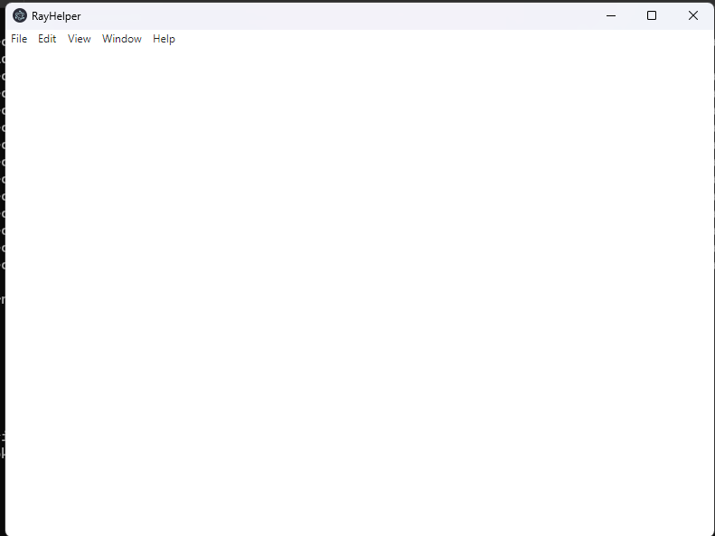

# RayHelper

A lightweight and developer-friendly assistant for managing and debugging distributed applications.  
RayHelper simplifies job orchestration, visualizes execution graphs, and provides a GUI and CLI for quick diagnostics — making Ray more accessible to teams at any scale.

## Features
- System diagnostics
- Issue reporting
- Knowledge base

## Screenshots


## Installation
1. Clone the repository:
   ```bash
   git clone https://github.com/nashe223/RayHelper.git


## Why It Matters

Ray is a powerful distributed computing framework, but debugging and job monitoring can be complex and unintuitive.  
**RayHelper** bridges that gap by offering both CLI and GUI interfaces for quickly inspecting task trees, diagnosing failed jobs, and understanding runtime behavior.

Ideal for:
- Data scientists and ML engineers needing quick diagnostics into their applications tasks
- DevOps engineers managing distributed pipelines
- Teams debugging workloads in production
